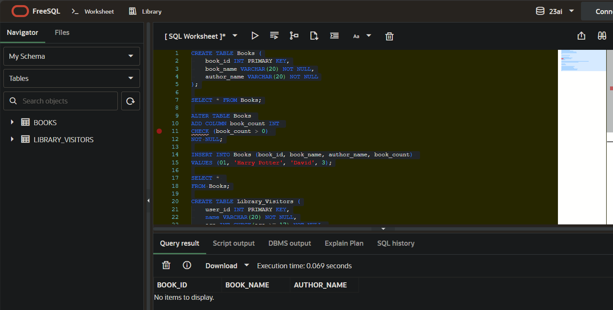
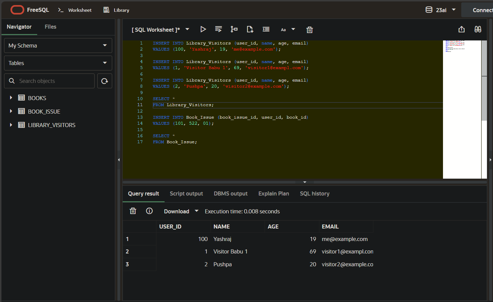

# Experiment 1: Database Tables and Relationships

## 1. Aim of the Session
To understand and implement SQL table creation and data insertion operations in a library management system, including working with constraints and foreign key relationships.

## 2. Software Requirements
- **Database Management System**: MySQL / PostgreSQL / SQL Server
- **SQL Client**: MySQL Workbench / pgAdmin / SQL Server Management Studio
- **Operating System**: Windows / Linux / macOS
- **Minimum RAM**: 4 GB
- **Disk Space**: 100 MB for database installation

## 3. Objectives
- Create tables with constraints (PRIMARY KEY, NOT NULL, CHECK, UNIQUE)
- Establish foreign key relationships between tables
- Insert data into multiple related tables
- Understand basic table structure and relationships
- Implement role-based access control with database users
- Grant and manage user permissions for database objects

## 4. Procedure of the Experiment
1. Insert data into the `Books` table
3. Create the `Library_Visitors` table with age and email validation
4. Insert data into the `Library_Visitors` table
5. Create the `Book_Issue` table to track book borrowing with foreign keys
6. Insert data into the `Book_Issue` table
7. Create database roles (Librarian and Admin)
8. Grant appropriate permissions to rohips between tables
5. Insert sample data into all tables

## 5. Practical / Experiment Steps

### Step 1: Create Books Table
```sql
CREATE TABLE Books (
    book_id INT PRIMARY KEY,
    book_name VARCHAR(20) NOT NULL,
    author_name VARCHAR(20) NOT NULL,
    book_count INT CHECK (book_count > 0) NOT NULL
);
```

### Step 2: Insert Data into Books Table
```sql
INSERT INTO Books (book_id, book_name, author_name, book_count) 
VALUES (01, 'Harry Potter', 'David', 3);
```

### Step 3: Create Library_Visitors Table
```sql
CREATE TABLE Library_Visitors (
    user_id INT PRIMARY KEY,
    name VARCHAR(20) NOT NULL,
    age INT CHECK(age >= 17) NOT NULL,
    email VARCHAR(20) NOT NULL UNIQUE
);
```

### Step 4: Insert Data into Library_Visitors Table
```sql
INSERT INTO Library_Visitors (user_id, name, age, email)
VALUES 
    (100, 'Yashraj', 19, 'me@example.com'),
    (1, 'Visitor Babu 1', 69, 'visitor1@exampl.com'),
    (2, 'Pushpa', 20, 'visitor2@example.com');
```

### Step 5: Create Book_Issue Table with Foreign Keys
```sql
CREATE TABLE Book_Issue(
    book_issue_id INT PRIMARY KEY,
    user_id INT NOT NULL,
    book_id INT NOT NULL,
    FOREIGN KEY (user_id) REFERENCES Library_Visitors (user_id),
    FOREIGN KEY (book_id) REFERENCES Books (book_id)
);
```

### Step 6: Insert Data into Book_Issue Table
```

### Step 7: Create Librarian Role with Login
```sql
CREATE ROLE Librarian WITH LOGIN PASSWORD 'LibrarianOnTop123!';
```

### Step 8: Grant Permissions to Librarian Role
```sql
-- Permissions to Books Table
GRANT SELECT, INSERT, UPDATE ON Books TO Librarian;

-- Permissions to Library_Visitors Table
GRANT SELECT, INSERT, UPDATE ON Library_Visitors TO Librarian;e.com'
- User ID: 2, Name: 'Pushpa', Age: 20, Email: 'visitor2@example.com'

**Book_Issue Table:**
- Issue ID: 1, User ID: 100, Book ID: 01

**Roles Created:**
- **Librarian Role**: SELECT, INSERT, UPDATE on Books and Library_Visitors; SELECT, INSERT, UPDATE, DELETE on Book_Issue
- **Admin Role**: ALL PRIVILEGES on all tables

### Expected Output:
- All tables created successfully with appropriate constraints
- Data inserted without constraint violations
- Foreign key relationships established between tables
- Librarian role created with limited permissions
- Admin role created with full permission

### Step 10: Grant All Privileges to Admin Role
```sql
GRANT ALL PRIVILEGES ON Books TO Admin;
GRANT ALL PRIVILEGES ON Library_Visitors TO Admin;
GRANT ALL PRIVILEGES ON Book_Issue TO Admin;
```sql
INSERT INTO Book_Issue (book_issue_id, user_id, book_id)
VALUES (1, 100, 01);
```

## 6. Input / Output Details and Screenshot

### Input Data:
**Books Table:**
- Book ID: 01, Name: 'Harry Potter', Author: 'David', Count: 3

**Library_Visitors Table:**
- User ID: 100, Name: 'Yashraj', Age: 19, Email: 'me@example.com'
- User ID: 1, Name: 'Visitor Babu 1', Age: 69, Email: 'visitor1@exampl.com'
- User ID: 2, Name: 'Pushpa', Age: 20, Email: 'visitor2@example.com'

**Book_Issue Table:**
- Issue ID: 1, User ID: 100, Book ID: 01

### Expected Output:
- Create database roles for access control
- Grant and manage permissions for database objects
- Understand the importance of data validation constraints
- Apply role-based security in database designints
- Data inserted without constraint violations
- Foreign key relationships established between tables
- Query results show proper data integrity and relationships

### Screenshots:

#### 1. Books Table Structure

*Table structure showing columns and constraints*

#### 2. Books Table Data

*SELECT * FROM Books output showing inserted data*

## 7. Learning Outcome
After completing this experiment, students will be able to:
- Create tables with constraint types (PRIMARY KEY, NOT NULL, CHECK, UNIQUE)
- Establish foreign key relationships between tables
- Insert data into multiple related tables
- Understand table structure and relationships
- Implement referential integrity in database design
- Work with multi-table database systems
- Understand the importance of data validation constraints
