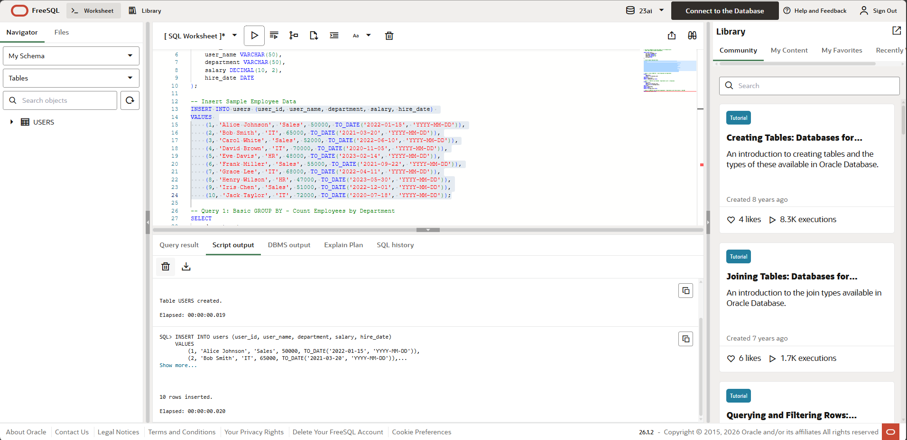
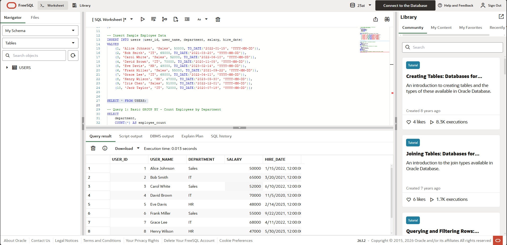
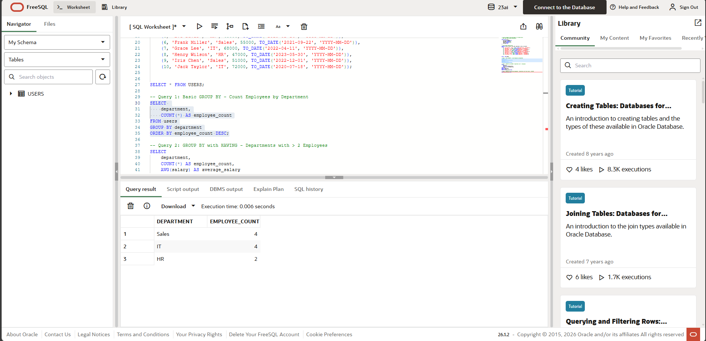
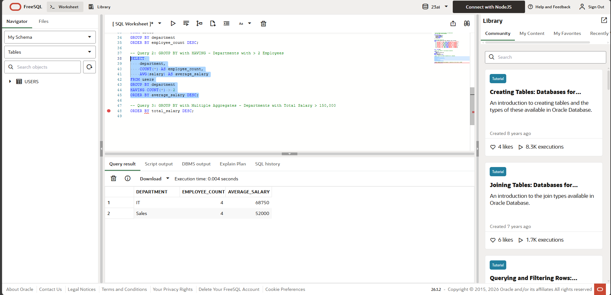
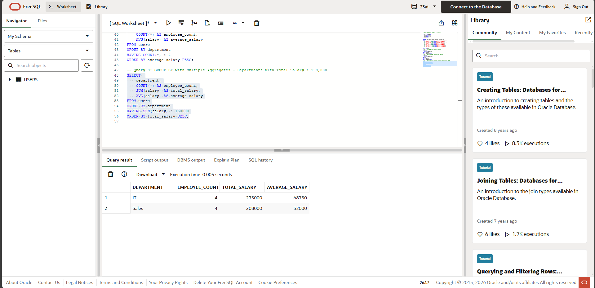

# Experiment 2: GROUP BY and HAVING Clause

## 1. Aim of the Session
To understand and implement SQL aggregate functions, GROUP BY clause for data grouping, and HAVING clause for filtering grouped data in order to perform data analysis and generate meaningful reports.

## 2. Software Requirements
- **Database Management System**: MySQL / PostgreSQL / SQL Server
- **SQL Client**: MySQL Workbench / pgAdmin / SQL Server Management Studio
- **Operating System**: Windows / Linux / macOS
- **Minimum RAM**: 4 GB
- **Disk Space**: 100 MB for database installation

## 3. Objectives
- Understand the purpose and syntax of GROUP BY clause
- Learn to use aggregate functions (COUNT, SUM, AVG, MAX, MIN)
- Implement HAVING clause for filtering grouped results
- Differentiate between WHERE and HAVING clauses
- Generate analytical reports using grouped data
- Combine multiple aggregate functions in a single query
- Apply ORDER BY to sort grouped results

## 4. Procedure of the Experiment
1. Create a `users` table to store employee information
2. Insert sample data representing employees from different departments
3. Execute basic GROUP BY queries to count employees per department
4. Apply aggregate functions (SUM, AVG) on grouped data
5. Use HAVING clause to filter groups based on conditions
6. Combine GROUP BY, HAVING, and ORDER BY for complex queries
7. Analyze results to derive meaningful business insights

## 5. Practical / Experiment Steps

### Step 1: Create Users Table
```sql
CREATE TABLE users (
    user_id INT PRIMARY KEY,
    user_name VARCHAR(50),
    department VARCHAR(50),
    salary DECIMAL(10, 2),
    hire_date DATE
);
```

### Step 2: Insert Sample Data
```sql
INSERT INTO users VALUES 
(1, 'Alice Johnson', 'Sales', 50000, '2022-01-15'),
(2, 'Bob Smith', 'IT', 65000, '2021-03-20'),
(3, 'Carol White', 'Sales', 52000, '2022-06-10'),
(4, 'David Brown', 'IT', 70000, '2020-11-05'),
(5, 'Eve Davis', 'HR', 48000, '2023-02-14'),
(6, 'Frank Miller', 'Sales', 55000, '2021-09-22'),
(7, 'Grace Lee', 'IT', 68000, '2022-04-11'),
(8, 'Henry Wilson', 'HR', 47000, '2023-05-30'),
(9, 'Iris Chen', 'Sales', 51000, '2022-12-01'),
(10, 'Jack Taylor', 'IT', 72000, '2020-07-18');
```

### Step 3: Basic GROUP BY Query - Count Employees by Department
```sql
SELECT 
    department,
    COUNT(*) AS employee_count
FROM users
GROUP BY department
ORDER BY employee_count DESC;
```

### Step 4: GROUP BY with HAVING - Filter Departments
```sql
SELECT 
    department,
    COUNT(*) AS employee_count,
    AVG(salary) AS average_salary
FROM users
GROUP BY department
HAVING COUNT(*) > 2
ORDER BY average_salary DESC;
```

### Step 5: GROUP BY with Multiple Aggregates and HAVING
```sql
SELECT 
    department,
    COUNT(*) AS employee_count,
    SUM(salary) AS total_salary,
    AVG(salary) AS average_salary
FROM users
GROUP BY department
HAVING SUM(salary) > 150000
ORDER BY total_salary DESC;
```

## 6. Input / Output Details and Screenshot

### Input Data:
**Users Table:** 10 employees across 3 departments (Sales, IT, HR)
- **Sales**: 4 employees (Alice, Carol, Frank, Iris)
- **IT**: 4 employees (Bob, David, Grace, Jack)
- **HR**: 2 employees (Eve, Henry)

### Query 1 Output - Employee Count by Department:
```
+------------+----------------+
| department | employee_count |
+------------+----------------+
| Sales      |              4 |
| IT         |              4 |
| HR         |              2 |
+------------+----------------+
```

### Query 2 Output - Departments with > 2 Employees:
```
+------------+----------------+----------------+
| department | employee_count | average_salary |
+------------+----------------+----------------+
| IT         |              4 |       68750.00 |
| Sales      |              4 |       52000.00 |
+------------+----------------+----------------+
```

### Query 3 Output - Departments with Total Salary > 150,000:
```
+------------+----------------+--------------+----------------+
| department | employee_count | total_salary | average_salary |
+------------+----------------+--------------+----------------+
| IT         |              4 |    275000.00 |       68750.00 |
| Sales      |              4 |    208000.00 |       52000.00 |
+------------+----------------+--------------+----------------+
```

### Screenshots:

#### 1. Table Creation and Data Insertion

*Confirmation of table creation and data insertion*

#### 2. All Users Data

*SELECT * FROM users showing all 10 employee records*

#### 3. Query 1 Output - Basic GROUP BY

*Employee count by department*

#### 4. Query 2 Output - GROUP BY with HAVING

*Departments with > 2 employees and their average salary*

#### 5. Query 3 Output - Complex Aggregate Query

*Departments with total salary > 150,000*

## 7. Learning Outcome
After completing this experiment, students will be able to:
- Use GROUP BY clause to organize data into logical groups
- Apply aggregate functions (COUNT, SUM, AVG, MAX, MIN) for statistical analysis
- Implement HAVING clause to filter grouped results based on conditions
- Distinguish between WHERE (filters individual rows) and HAVING (filters groups)
- Combine multiple aggregate functions in a single query
- Generate meaningful business reports from raw data
- Sort grouped results using ORDER BY clause
- Analyze salary distributions and department-wise statistics
- Make data-driven decisions based on aggregated insights
- Design queries for complex analytical requirements
