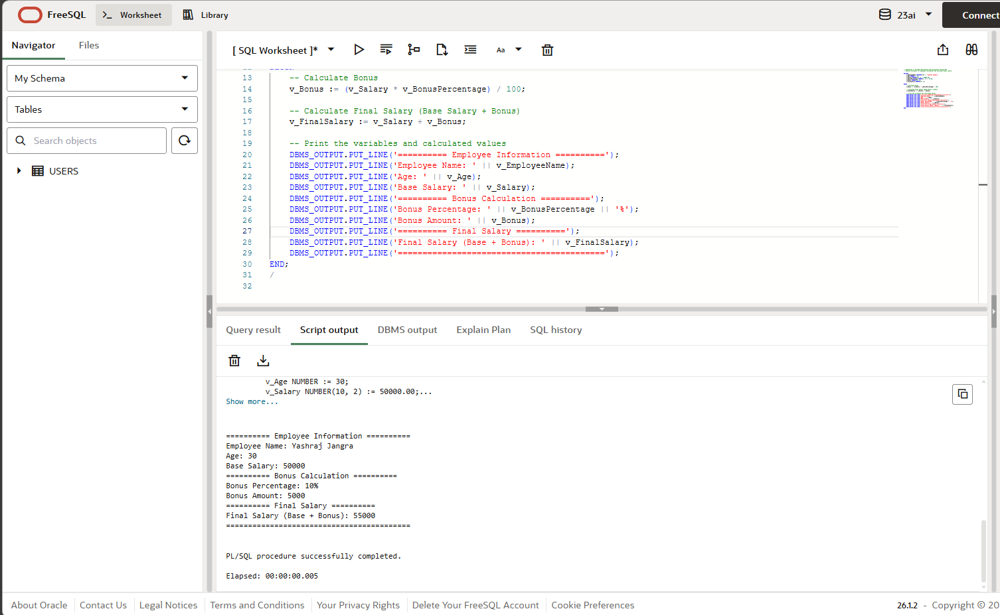

# Experiment 3: Variables Declaration and Calculation in PL/SQL

## 1. Aim of the Session
To understand and implement PL/SQL variable declaration, initialization, and arithmetic calculations with output operations in Oracle Database environment.

## 2. Software Requirements
- **Database Management System**: Oracle Database (12c or higher)
- **SQL Client**: Oracle SQL Developer / Oracle SQL*Plus / Toad
- **Operating System**: Windows / Linux / macOS
- **Minimum RAM**: 4 GB
- **Disk Space**: 500 MB for Oracle installation

## 3. Objectives
- Declare and initialize variables in PL/SQL
- Understand different data types (VARCHAR2, NUMBER)
- Perform arithmetic operations on numeric variables
- Implement calculations for business logic
- Use assignment operators in PL/SQL
- Display output using DBMS_OUTPUT.PUT_LINE()
- Understand the structure of PL/SQL anonymous blocks

## 4. Procedure of the Experiment
1. Declare variables for employee name, age, salary, and bonus percentage
2. Initialize variables with sample values
3. Calculate bonus amount based on salary and bonus percentage
4. Calculate final salary (base salary + bonus)
5. Display all variables and calculated values using DBMS_OUTPUT.PUT_LINE()
6. Execute the PL/SQL block in Oracle Database

## 5. Practical / Experiment Steps

### Step 1: Enable Output Display
Before executing the script, enable output in SQL Developer or SQL*Plus:
```sql
SET SERVEROUTPUT ON;
```

### Step 2: Declare Variables
```sql
DECLARE
    v_EmployeeName VARCHAR2(50) := 'Yashraj Jangra';
    v_Age NUMBER := 30;
    v_Salary NUMBER(10, 2) := 50000.00;
    v_BonusPercentage NUMBER(5, 2) := 10.00;
    v_Bonus NUMBER(10, 2);
    v_FinalSalary NUMBER(10, 2);
```

### Step 3: Calculate Bonus and Final Salary
```sql
BEGIN
    v_Bonus := (v_Salary * v_BonusPercentage) / 100;
    v_FinalSalary := v_Salary + v_Bonus;
```

### Step 4: Display Results
```sql
    DBMS_OUTPUT.PUT_LINE('========== Employee Information ==========');
    DBMS_OUTPUT.PUT_LINE('Employee Name: ' || v_EmployeeName);
    DBMS_OUTPUT.PUT_LINE('Age: ' || v_Age);
    DBMS_OUTPUT.PUT_LINE('Base Salary: ' || v_Salary);
    DBMS_OUTPUT.PUT_LINE('========== Bonus Calculation ==========');
    DBMS_OUTPUT.PUT_LINE('Bonus Percentage: ' || v_BonusPercentage || '%');
    DBMS_OUTPUT.PUT_LINE('Bonus Amount: ' || v_Bonus);
    DBMS_OUTPUT.PUT_LINE('========== Final Salary ==========');
    DBMS_OUTPUT.PUT_LINE('Final Salary (Base + Bonus): ' || v_FinalSalary);
    DBMS_OUTPUT.PUT_LINE('==========================================');
END;
/
```

## 6. Key Concepts

### Variable Declaration
- Variables in PL/SQL are declared in the DECLARE section
- Syntax: `variable_name datatype := initial_value;`
- The `:=` operator is used for assignment in PL/SQL

### Data Types Used
- **VARCHAR2**: Variable-length character string used for employee name
- **NUMBER(10,2)**: Numeric type with 10 digits total and 2 decimal places for salary

### String Concatenation
- The `||` operator concatenates strings with variables
- Automatic type conversion occurs when concatenating numbers with strings

### Output Display
- `DBMS_OUTPUT.PUT_LINE()` is used to display output in Oracle Database
- Must enable `SET SERVEROUTPUT ON;` before execution

## 7. Expected Output
```
========== Employee Information ==========
Employee Name: Yashraj Jangra
Age: 30
Base Salary: 50000
========== Bonus Calculation ==========
Bonus Percentage: 10%
Bonus Amount: 5000
========== Final Salary ==========
Final Salary (Base + Bonus): 55000
==========================================
```

## 8. Screenshots
Screenshots demonstrating the execution of the PL/SQL script and output results:



## 9. Conclusion
This experiment demonstrates the fundamental concepts of PL/SQL including variable declaration, initialization, arithmetic operations, and formatted output display, which are essential building blocks for developing more complex database programs and stored procedures.
