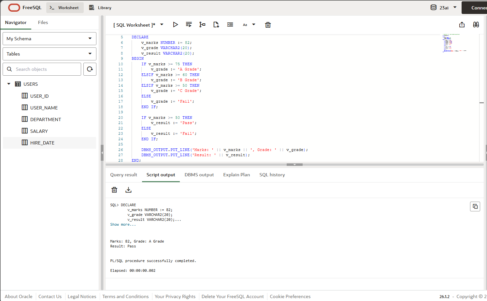
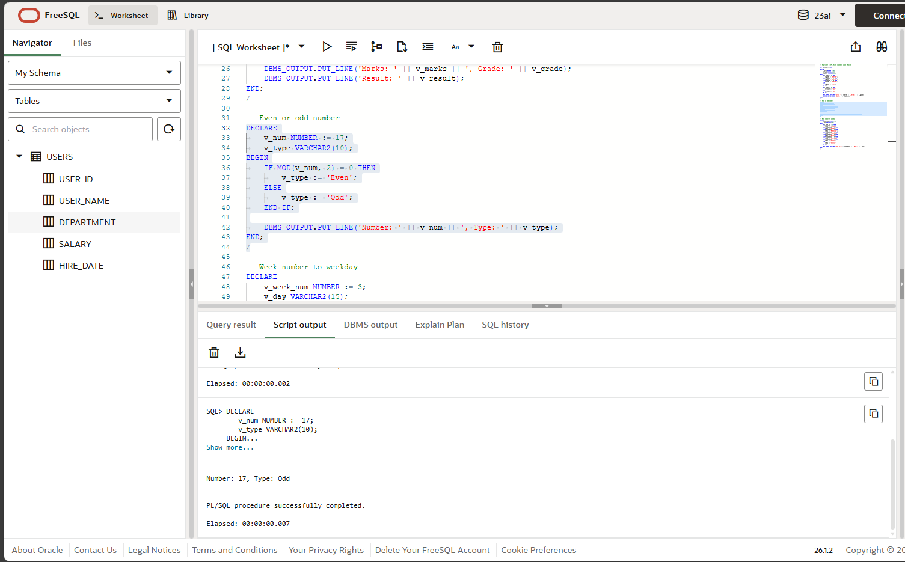
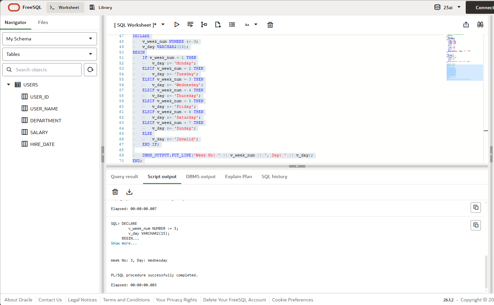

# Experiment 4: IF...ELSIF in PL/SQL

## 1. Aim of the Session
To understand and implement IF...ELSIF decision making in PL/SQL using simple anonymous blocks.

## 2. Software Requirements
- **Database Management System**: Oracle Database (12c or higher)
- **SQL Client**: Oracle SQL Developer / Oracle SQL*Plus / Toad
- **Operating System**: Windows / Linux / macOS
- **Minimum RAM**: 4 GB
- **Disk Space**: 500 MB for Oracle installation

## 3. Objectives
- Use IF...ELSIF...ELSE to derive grades from marks
- Use IF...ELSE to check even/odd numbers
- Map week numbers to weekdays
- Display results with DBMS_OUTPUT.PUT_LINE()
- Execute PL/SQL anonymous blocks

## 4. Procedure of the Experiment
1. Enable output using `SET SERVEROUTPUT ON`
2. Run the grading block (marks to grade, pass/fail)
3. Run the even/odd block
4. Run the week number to weekday block
5. Observe the output in the SQL client

## 5. Practical / Experiment Steps

### Step 1: Enable Output Display
```sql
SET SERVEROUTPUT ON;
```

### Step 2: Grading Using IF...ELSIF
```sql
DECLARE
    v_marks NUMBER := 82;
    v_grade VARCHAR2(20);
    v_result VARCHAR2(20);
BEGIN
    IF v_marks >= 75 THEN
        v_grade := 'A Grade';
    ELSIF v_marks >= 60 THEN
        v_grade := 'B Grade';
    ELSIF v_marks >= 50 THEN
        v_grade := 'C Grade';
    ELSE
        v_grade := 'Fail';
    END IF;

    IF v_marks >= 50 THEN
        v_result := 'Pass';
    ELSE
        v_result := 'Fail';
    END IF;

    DBMS_OUTPUT.PUT_LINE('Marks: ' || v_marks || ', Grade: ' || v_grade);
    DBMS_OUTPUT.PUT_LINE('Result: ' || v_result);
END;
/
```

### Step 3: Even or Odd Number
```sql
DECLARE
    v_num NUMBER := 17;
    v_type VARCHAR2(10);
BEGIN
    IF MOD(v_num, 2) = 0 THEN
        v_type := 'Even';
    ELSE
        v_type := 'Odd';
    END IF;

    DBMS_OUTPUT.PUT_LINE('Number: ' || v_num || ', Type: ' || v_type);
END;
/
```

### Step 4: Week Number to Weekday
```sql
DECLARE
    v_week_num NUMBER := 3;
    v_day VARCHAR2(15);
BEGIN
    IF v_week_num = 1 THEN
        v_day := 'Monday';
    ELSIF v_week_num = 2 THEN
        v_day := 'Tuesday';
    ELSIF v_week_num = 3 THEN
        v_day := 'Wednesday';
    ELSIF v_week_num = 4 THEN
        v_day := 'Thursday';
    ELSIF v_week_num = 5 THEN
        v_day := 'Friday';
    ELSIF v_week_num = 6 THEN
        v_day := 'Saturday';
    ELSIF v_week_num = 7 THEN
        v_day := 'Sunday';
    ELSE
        v_day := 'Invalid';
    END IF;

    DBMS_OUTPUT.PUT_LINE('Week No: ' || v_week_num || ', Day: ' || v_day);
END;
/
```

## 6. Expected Output
```
Marks: 82, Grade: A Grade
Result: Pass
Number: 17, Type: Odd
Week No: 3, Day: Wednesday
```

## 7. Screenshots
Screenshots demonstrating each IF...ELSIF block execution:





## 8. Conclusion
This experiment demonstrates decision making with IF...ELSIF in PL/SQL using simple anonymous blocks and output display with DBMS_OUTPUT.
